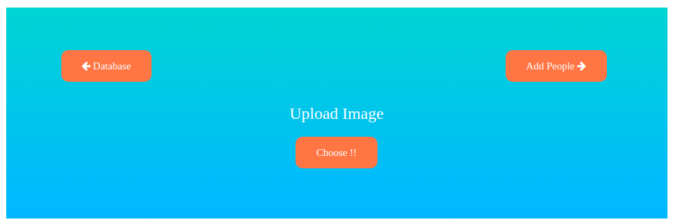

# Image Recognition Website

## Introduction 
 
This repository bundles a web application with following functionalities ,
- Face Recognition 
- Object Detection
- Monument Recognition

## Installations 

1. [Install Anaconda ](https://docs.anaconda.com/anaconda/install/)
2. In Anaconda navigator, go to environments tab checkout the packages which are not installed and install the following ,

    - Open CV
    - Tensor-flow 2.0
3. All other required packages are pre-installed in Anaconda.

## Usage 

1. Clone or download our Github repository .
2. Save the [model](https://github.com/OlafenwaMoses/ImageAI/releases/download/1.0/yolo.h5) to the main directory as *model.h5* .
3. Now run *app.py* in Spyder.
4. Open [local address](http://127.0.0.1:5000/) in a browser.

## Detailed explanation 

1. **Face Recognition** : 
         
- For, Face recognition we are using FaceNet model (a pre-trained model), this DNN model takes an input image and outputs corresponding 128-length vector.(embedding of an image)
- This 128-length vector is used to compare image . Here, we use l2-norm of difference 2 vectors (difference vector) , this specifies how similar/different 2 images are.(call it distance)
- In our database(a directory) we store all the images corresponding to one person in a directory with his name .
- When we start the website the , a python dictionary is created whose keys are the names of persons in our database and the corresponding values are the python lists.
- Each python list contains the embeddings of all images corresponding to that person.
- Now when a new image is uploaded in our website , we get 128-length embedding of this image using the model and we calculate the average distance of this image with all the persons in our database .
- Average distance : Average distance between a new image & a person is the average of all the distances between new image and all the images of that person .
- Now we take the minimum of all the average distances and if this is smaller than our threshold , this image is considered as the person corresponding to that distance. If the minimum of avg. distances is greater than the threshold , we consider that the person in the image is not in our database.
- Actually the embeddings are not calculated from the original image but form the face-cropped versions of original image .
- This cropping is using the help of openCV .
- Infact , our algorithm is capable of handling multiple faces in the image while predicting .

2. **Object Detection** :

- The other important feature of our website is that, it detects various objects belonging to 80 different classes and draws bounding boxes around them .Here, we took the help of YOLO algorithm .
- Have a look at [YOLO](https://pjreddie.com/darknet/yolo/) .
- In our website along with Face Recognition result , we output the image containing the bounding boxes of detected classes.

## Working of website : 

### Our web application has 4 pages 
1.  **Main/Predict page :** 
       - We can upload images to get Face recognition , detection outputs and monument recognition outputs.
    
2.  **Database page :** 
       - We can have a look at the list of persons in our database. 
       - We have a choice to remove them too.
       - On selecting a person we are redirected to a page containing list of all images corresponding to that person.
3.  **Add People :**
       - We can add people to our database from this page .
       - Just upload person name and an image of that person , thats it , the person is added to our database. 

